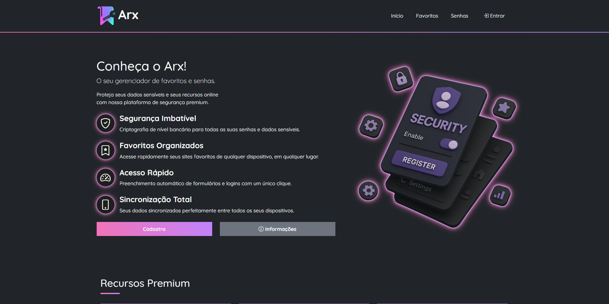

<h1 align="center">🌐 Portfólio - Luís Lima</h1>

<p align="center">
  <em>Desenvolvedor Web Frontend & Técnico em Informática para Internet</em><br>
  <a href="https://github.com/LGSLima"></a>
  <a href="mailto:lgslima@proton.me"></a>
</p>

---

## 🧭 Sumário

- [📌 Sobre](#-sobre)
- [🛠️ Tecnologias Utilizadas](#️-tecnologias-utilizadas)
- [💼 Projetos em Destaque](#-projetos-em-destaque)
- [📷 Pré-visualização](#-pré-visualização)
- [👨‍💻 Sobre Mim](#-sobre-mim)
- [📫 Contato](#-contato)
- [⚙️ Como Executar Localmente](#️-como-executar-localmente)
- [📝 Licença](#-licença)

---

## 📌 Sobre

Este repositório contém meu portfólio pessoal — uma vitrine dos meus principais projetos, habilidades e experiências no desenvolvimento web.

---

## 🛠️ Tecnologias Utilizadas

- `HTML5`
- `CSS3 + Bootstrap 5`
- `JavaScript`
- `PHP`
- `Google Fonts`
- `Bootstrap Icons`

---

## 💼 Projetos em Destaque

| Projeto      | Descrição                                               | Tecnologias Principais                     | Link |
|--------------|---------------------------------------------------------|--------------------------------------------|------|
| **Arx**      | Plataforma para gerenciamento de favoritos e senhas     | HTML, CSS (Bootstrap), JS, PHP             | [🔗 Conheça](https://github.com/LGSLima/Arx) |
| **Unity+**   | Plataforma de desenvolvimento comunitário               | HTML, CSS (Bootstrap), JS, PHP             | [🔗 Conheça](https://github.com/LGSLima/Demanda-Petrobras-TCC) |
| **SigeEdu**  | Sistema acadêmico de cadastro de estudantes             | HTML, CSS (Bootstrap), JS, PHP             | [🔗 Conheça](https://github.com/LGSLima/Apredizado-WAMP/tree/main/Aula-24-06-2025/atividade1) |
| **Calculadora de Figuras** | Cálculo de áreas geométricas básicas     | HTML, CSS (Bootstrap), JS                  | [🔗 Conheça](https://github.com/LGSLima/Aprendizado-JS/tree/main/Aula-06-05-2025) |

---

## 📷 Pré-visualização

<p align="center">
  
</p>

---

## 👨‍💻 Sobre Mim

Profissional com experiência em manutenção de computadores, suporte técnico e atualmente focado no desenvolvimento web.  
Busco oportunidades em infraestrutura de TI e desenvolvimento de sistemas utilizando:

- HTML5, CSS3, JavaScript
- PHP e MySQL
- Bootstrap
- Ferramentas modernas de versionamento e hospedagem (GitHub)

Sou apaixonado por tecnologia e estou sempre buscando novos desafios para aplicar meus conhecimentos em projetos práticos.

---

## 📫 Contato

- 📧 Email: [lgslima@proton.me](mailto:lgslima@proton.me)
- 🐙 GitHub: [github.com/LGSLima](https://github.com/LGSLima)
- 💼 LinkedIn: [linkedin.com/in/lgslima](https://www.linkedin.com/in/lgslima/)
- 📸 Instagram: [@lgslima0](https://www.instagram.com/lgslima0/)

---

## ⚙️ Como Executar Localmente

```bash
git clone https://github.com/LGSLima/nome-do-repositorio.git
cd nome-do-repositorio
# Dê dois cliques em index.html ou abra com um navegador
